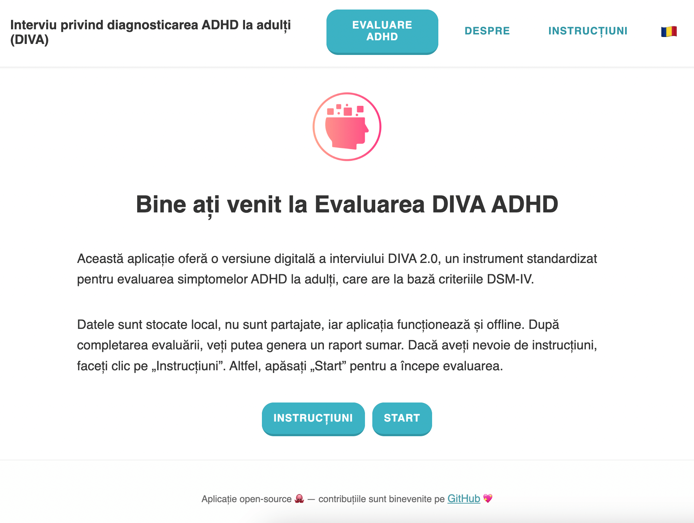

# 💖 About This Project

I created this project as a way for me to learn and practice front-end development, product thinking, and project management. Additionally, I am passionate about mental health and would like to support better digital tools in this field.

It’s open source, and contributions are more than welcome — whether it’s code, feedback, or just helpful ideas! It's still a work in progress and I'm learning as I go :)

# Diagnostic Interview for ADHD in adults (DIVA) Web Application

A web-based platform for administering the **DIVA 2.0 ADHD assessment**, built with React (Next.js). This application streamlines the evaluation process for clinicians by automating question flow, scoring, and report generation.

It is intended as a tool for medical professionals, and therefore does not provide a diagnosis or any interpretation of the ADHD evaluation beyond the summary of the answers. The target language is Romanian.



## 🚀 Features

- Interactive **ADHD assessment** questionnaire
- **Automated scoring** based on DSM-4 criteria
- **Report generation** for clinicians
- Secure patient data handling (future implementation)
- Built with **Next.js** for optimal performance

## 🛠️ Tech Stack

- **Frontend**: React, Next.js, Tailwind CSS
- **State Management**: Context API / Zustand (TBD)
- **Backend (Planned)**: Firebase / Supabase
- **Report Generation**: HTML-to-PDF (TBD)

## ⚙️ Getting Started

### 📋 Prerequisites

- **Node.js** (version 18 or higher recommended)
- **npm** (comes with Node.js)

### 📦 Installation

1. Clone the repository:
   ```
   git clone https://github.com/yourusername/diva-adhd-assessment.git
   cd diva-adhd-assessment
   ```
2. Install dependencies

   ```
   npm install
   ```

3. Start the development server
   ```
   npm run dev
   ```
